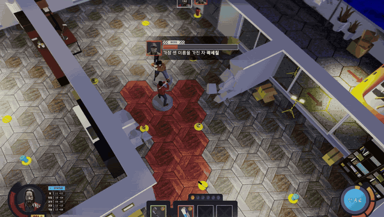

# A.P.T.

수몰되어 가는 아파트에서 층을 올라가며 탈출하는, DirectX 11 자체 엔진 기반 주사위 턴제 전략 게임입니다.

## 프로젝트 소개

A.P.T.는 주사위 판정과 턴제 전투를 활용해 침수되는 아파트에서 탈출하는 팀 프로젝트입니다. 게임 클라이언트와 함께 자체 엔진, 에디터, 에셋 임포터를 하나의 솔루션으로 개발했습니다.

- **탐험**: 이동 범위를 확인하며 층을 탐색하고, 주사위 판정으로 문 등의 상호작용을 진행
- **전투**: 주사위를 능력별 슬롯에 배정하고 선제권과 공격 범위를 고려하는 턴제 전투
- **탈출**: 턴 경과에 따라 높아지는 수위에 대응하며 다음 층으로 이동
- **자체 개발 환경**: 엔진·에디터·클라이언트를 연결해 씬과 컴포넌트, 에셋을 편집하고 게임에서 사용

## 개발 환경

| 항목 | 내용 |
| --- | --- |
| 개발 기간 | 7주 (2025.12 ~ 2026.02) |
| 플랫폼 | PC (Windows) |
| 엔진 | C++ 기반 자체 엔진, 4QEngine |
| 그래픽 API | DirectX 11 |
| 언어 | C++, HLSL |
| 개발 환경 | Windows, Visual Studio 2022 / MSVC v143 |
| 프로젝트 구성 | Engine, Editor, Client, MRenderer, GameObject, Importer, ResourceManager 등 |
| 주요 기술 | 컴포넌트 구조, 이벤트 시스템, FSM, Behavior Tree, 스켈레탈 애니메이션 |
| 데이터 구성 | JSON, CSV, 자체 바이너리 에셋 포맷 |
| 에셋·에디터 도구 | Assimp, Dear ImGui |
| 버전 관리 | Git |

## 주요 기능

### 게임플레이

- 탐험·전투·상점·층 전환을 관리하는 게임 진행 구조
- 주사위 판정, 능력별 주사위 배정, 선제권 기반 턴제 전투
- 이동·공격 범위 표시와 아이템·인벤토리 처리
- 턴 경과에 따른 수위 상승

### 공용 시스템·렌더 데이터 전달

- GameObject와 Component를 중심으로 기능을 조합하는 구조
- ServiceRegistry를 통한 공용 서비스 등록·조회와 이벤트 기반 시스템 간 통신
- 씬에서 RenderItem·FrameData를 구성하고 렌더러가 소비하는 데이터 전달 구조
- 리소스 핸들을 통한 메시·머티리얼·스켈레톤 참조
- 컴포넌트 속성 등록과 직렬화를 활용한 편집·저장·로드

### 에셋 파이프라인

- Assimp 기반 FBX 임포트와 메시·머티리얼·스켈레톤·애니메이션 데이터 변환
- 자체 바이너리·JSON 포맷과 메타데이터를 사용하는 런타임 로딩
- AssetLoader와 ResourceStore 기반 에셋 조회·캐싱
- 재임포트, 로드 비용 측정, 애니메이션 검증을 위한 별도 도구

### 스켈레탈 애니메이션

- 애니메이션 클립 재생과 로컬·글로벌 포즈 및 스키닝 행렬 계산
- 상태 전환에 따른 클립 블렌딩과 커브 기반 보간
- 본 마스크를 활용한 상하체 분리 블렌딩
- 리타겟 오프셋과 에디터 속성을 통한 애니메이션 조정

### 렌더링·에디터·UI

- 그림자, 불투명·투명 오브젝트, 굴절, 후처리, UI 등 렌더 패스 구성
- 에디터 뷰포트와 컴포넌트 속성 편집
- 버튼·이미지·텍스트·게이지·주사위 등 컴포넌트 기반 UI
- 데이터 기반 FSM과 이벤트를 활용한 게임플레이·UI 상태 전환

### 주요 코드 위치

아래 링크에서 각 기능의 구현을 확인할 수 있습니다. 팀 전체 기능을 기준으로 정리했으며, 저장소 소유자 jinys0527의 담당 범위는 하단 Contribution에 별도로 안내합니다.

| 영역 | 주요 코드 | 확인할 내용 |
| --- | --- | --- |
| 공용 시스템 | [ServiceRegistry.h](https://github.com/jinys0527/4QEngine/blob/master/Engine/ServiceRegistry.h), [EventDispatcher.cpp](https://github.com/jinys0527/4QEngine/blob/master/Event/EventDispatcher.cpp), [Scene.cpp](https://github.com/jinys0527/4QEngine/blob/master/Engine/Scene.cpp) | 서비스 접근, 이벤트 전달, 씬 관리 |
| 렌더 데이터 전달 | [RenderData.h](https://github.com/jinys0527/4QEngine/blob/master/ResourceManager/RenderData.h), [MeshRenderer.cpp](https://github.com/jinys0527/4QEngine/blob/master/GameObject/MeshRenderer.cpp), [Renderer.h](https://github.com/jinys0527/4QEngine/blob/master/MRenderer/Renderer.h) | RenderItem 구성과 FrameData를 받는 렌더러의 인터페이스 |
| 에셋 파이프라인 | [Importer.cpp](https://github.com/jinys0527/4QEngine/blob/master/Importer/Importer.cpp), [AssetLoader.cpp](https://github.com/jinys0527/4QEngine/blob/master/ResourceManager/AssetLoader.cpp), [ResourceStore.h](https://github.com/jinys0527/4QEngine/blob/master/ResourceManager/ResourceStore.h) | FBX 변환, 런타임 로딩, 리소스 캐싱 |
| 스켈레탈 애니메이션 | [AnimationComponent.cpp](https://github.com/jinys0527/4QEngine/blob/master/GameObject/AnimationComponent.cpp), [SkeletalMeshComponent.cpp](https://github.com/jinys0527/4QEngine/blob/master/GameObject/SkeletalMeshComponent.cpp), [AnimFSMComponent.cpp](https://github.com/jinys0527/4QEngine/blob/master/GameObject/AnimFSMComponent.cpp) | 포즈 계산, 블렌딩, 스켈레톤 및 상태 전환 |
| 게임플레이·UI | [GameManager.cpp](https://github.com/jinys0527/4QEngine/blob/master/Engine/GameManager.cpp), [CombatManager.cpp](https://github.com/jinys0527/4QEngine/blob/master/Engine/CombatManager.cpp), [UIFSMComponent.cpp](https://github.com/jinys0527/4QEngine/blob/master/GameObject/UIFSMComponent.cpp) | 게임 진행과 전투 턴, UI 상태 처리 |

## 솔루션 구조

| 프로젝트 | 역할 |
|---|---|
| `Engine` | 코어 루프, Scene, GameManager, CombatManager, InputManager, ServiceRegistry |
| `MRenderer` | DirectX 11 렌더러 (RenderData 인터페이스로 엔진과 분리) |
| `GameObject` | 컴포넌트 전체 (Transform, Mesh, Animation, UI, Player/Enemy FSM 등) |
| `AI` | Behavior Tree 프레임워크 (Composite/Decorator/Task, Blackboard) + FSM |
| `Event` | 이벤트 시스템 (전투·UI·게임 흐름이 이 위에서 통신) |
| `Importer` | Assimp 기반 에셋 임포터 (FBX → 자체 포맷, 에디터 전용) |
| `ResourceManager` | AssetLoader, RenderData, 리소스 key→handle 관리 |
| `Editor` | ImGui 기반 에디터 (프로퍼티, ResourceBrowser, UI 에디터) |
| `Client` | 게임 클라이언트 (런타임 전용, Assimp 의존 없음) |
| `SoundSystem` | FMOD 사운드 |
| `Common` | 수학 유틸, 타이머, JSON 등 공용 코드 |

## 빌드

- **요구 사항** : Visual Studio 2022 (v143), C++20, Windows 10+
- `4QEngine.sln`을 열고 `Editor`(에디터) 또는 `Client`(게임)를 시작 프로젝트로 지정 후 빌드
- `Importer`는 Assimp가 필요합니다 (vcpkg 설치) — 에디터에서 에셋을 다시 임포트할 때만 필요하며, `Client` 빌드·실행에는 필요 없습니다
- `vcpkg` 경로를 환경변수에 등록해야합니다(VCPKG_ROOT / ex. C:\vcpkg\)

## Team

프로그래머별 담당 범위와 팀 구성을 정리했습니다.

| 역할 | 담당 |
| --- | --- |
| 프로그래밍 · 진영상 ([jinys0527](https://github.com/jinys0527)) | 공용 시스템·렌더 데이터 전달, 에셋 파이프라인, 스켈레탈 애니메이션, UI 시스템·UI 에디터, FSM·BT 게임플레이 아키텍처, 게임 진행, 엔진 코어(ServiceRegistry·이벤트·직렬화) |
| 프로그래밍 · 황재하 (DotheZac) | DirectX 11 렌더러(MRenderer), 렌더 패스·셰이더·후처리, 전투 연출·아이템 등 인게임 연동 |
| 프로그래밍 · 홍한울 | 에디터 애플리케이션·뷰포트, 그리드 시스템, 플레이어·적 이동, GameManager 연동 |
| 기획 | 2명 |
| 아트 | 2명 |

## Contribution

### jinys0527

이 Repository를 제출하는 jinys0527의 주요 담당 작업과 구현 코드를 정리했습니다. 공용 시스템과 엔진·렌더러 사이의 데이터 전달 구조를 포함하며, DirectX 11 렌더러 구현은 Team에 기재한 황재하(DotheZac)의 담당 범위입니다.

| 담당 작업 | 구현 내용 | 주요 코드 |
| --- | --- | --- |
| 공용 시스템·렌더 데이터 전달 구조 개선 | 공용 서비스 접근과 이벤트 전달, 씬에서 렌더러로 전달하는 FrameData·RenderItem 구성 | [ServiceRegistry.h](https://github.com/jinys0527/4QEngine/blob/master/Engine/ServiceRegistry.h), [RenderData.h](https://github.com/jinys0527/4QEngine/blob/master/ResourceManager/RenderData.h), [MeshRenderer.cpp](https://github.com/jinys0527/4QEngine/blob/master/GameObject/MeshRenderer.cpp) |
| 자체 포맷 기반 에셋 파이프라인 | FBX 임포트와 자체 포맷 변환, 런타임 로딩·리소스 캐싱 | [Importer.cpp](https://github.com/jinys0527/4QEngine/blob/master/Importer/Importer.cpp), [AssetLoader.cpp](https://github.com/jinys0527/4QEngine/blob/master/ResourceManager/AssetLoader.cpp) |
| 스켈레탈 애니메이션 시스템 | 포즈 계산, 클립 블렌딩, 본 마스크 기반 상하체 분리 및 리타겟 오프셋 | [AnimationComponent.cpp](https://github.com/jinys0527/4QEngine/blob/master/GameObject/AnimationComponent.cpp), [SkeletalMeshComponent.cpp](https://github.com/jinys0527/4QEngine/blob/master/GameObject/SkeletalMeshComponent.cpp) |
| 데이터 기반 FSM 및 에디터 연동 | 상태·전이·액션의 데이터화와 속성 편집·직렬화 연결 | [FSMComponent.cpp](https://github.com/jinys0527/4QEngine/blob/master/GameObject/FSMComponent.cpp), [FSMActionRegistry.cpp](https://github.com/jinys0527/4QEngine/blob/master/GameObject/FSMActionRegistry.cpp), [Reflection.h](https://github.com/jinys0527/4QEngine/blob/master/GameObject/Reflection.h) |
| Phase·TurnState 기반 게임 진행 시스템 | 탐험·전투·상점·층 전환의 진행 상태와 이벤트 기반 흐름 관리 | [GameManager.cpp](https://github.com/jinys0527/4QEngine/blob/master/Engine/GameManager.cpp), [GameState.h](https://github.com/jinys0527/4QEngine/blob/master/Engine/GameState.h) |

## Portfolio

설계 의도, 문제 해결 과정과 검증 결과는 [jinys0527의 A.P.T. 포트폴리오](https://bubble-dingo-437.notion.site/A-P-T-3928c73c43f98390aa0901ce3d19fd25?pvs=74)에서 확인할 수 있습니다.

개발 작업 기록은 [작업 기록 문서](https://app.notion.com/p/39a8c73c43f980e9867aed98a688d9d4)에서 확인할 수 있습니다.
